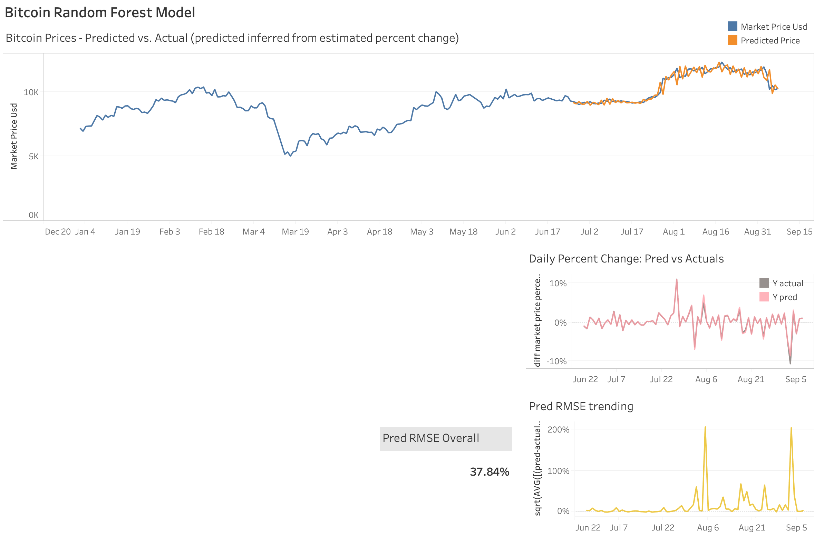
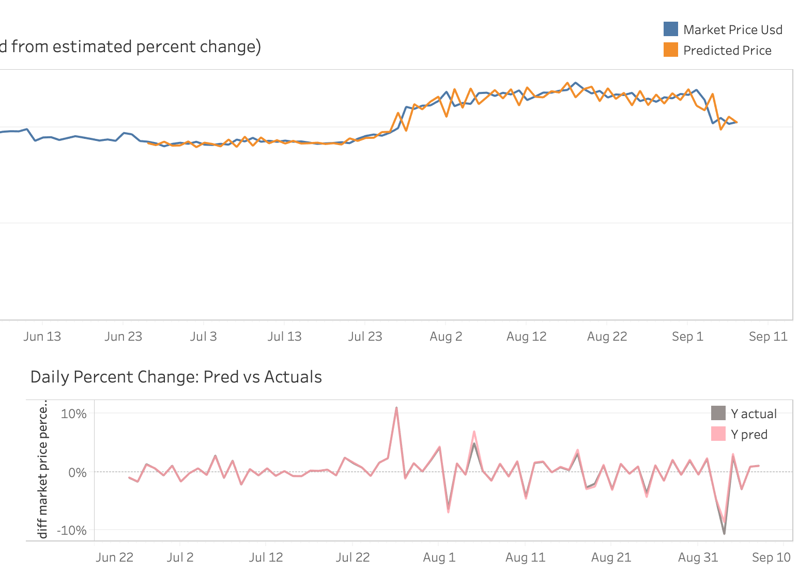

# bitcoin-rf
tl;dr: Modeling Bitcoin daily percent changes with a Random Forest model

Used GoogleNews Python library to pull in Top 30 'bitcoin' stories per day from Jan 1, 2020 through present. Then, performed NLTK sentiment analysis on each headline and averaged the compound score by date. This average sentiment score is a feature going into the Random Forest. Additionally, a "Signal" feature is designed (in another codebase) that is defined as:

* If daily price decrease >= 2% then "buy"
* elseif daily price increase >= 2% then "sell"
* else null

Approximately 1,800 models were explored for the job run that selected the parameters included in this repo. Below are modeling results. 

Zoomed in a bit to the prediction period:

The crypto Bitcoin data (not supplied) is proprietary to Finditly, LLC.
